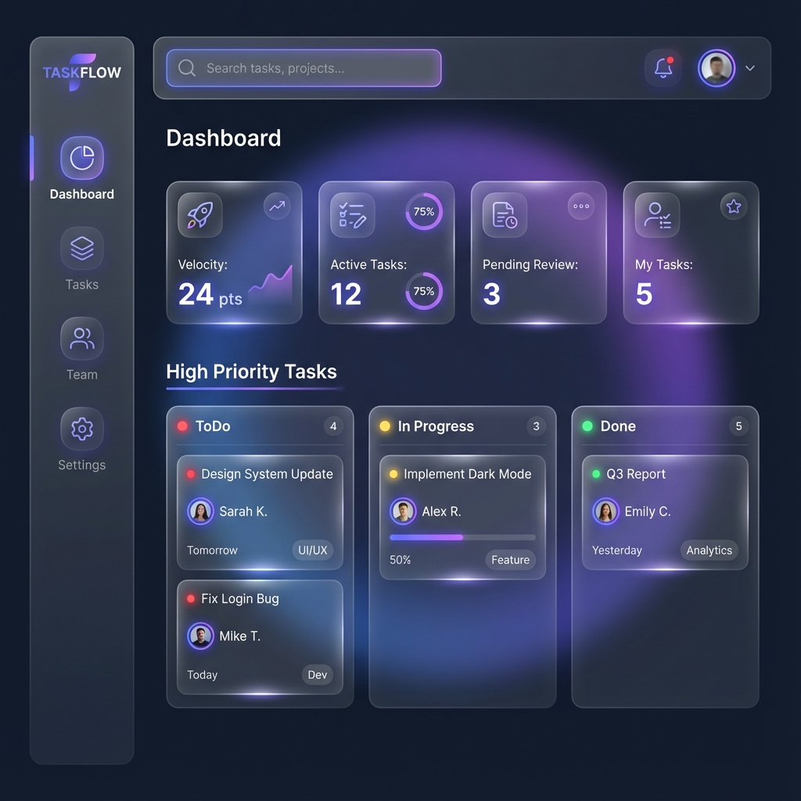

# Dashboard Page Design

## Overview
The Dashboard serves as the command center for the application, providing a high-level overview of team activity, project health, and personal tasks.

## Visual Reference

## Key Features

### 1. Statistics Row
A row of cards at the top displaying key metrics:
- **Team Velocity**: Tasks completed in the current sprint/week.
- **Active Tasks**: Number of tasks currently in progress.
- **Pending Review**: Tasks waiting for approval.
- **My Tasks**: Count of tasks assigned to the current user.

### 2. Main Workspace (Kanban Preview)
A simplified view of the Kanban board or a "Focus" view showing high-priority items.
- **Quick Actions**: "Create Task", "Filter by Me".
- **Card Interaction**: Click to open task details modal.

### 3. Activity Feed (Optional)
A sidebar or section showing recent updates (e.g., "Alice moved Task-123 to Done").

## Layout
- **Sidebar**: Fixed on the left (collapsible).
- **Top Bar**: Search, Notifications, Profile.
- **Content Area**: Fluid grid layout.
