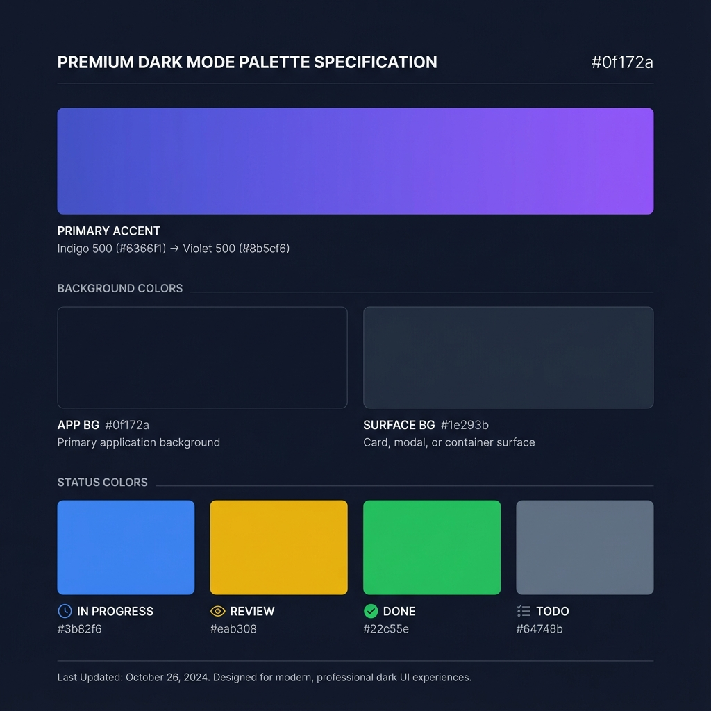

# Design Consistency Guide

This document provides concrete implementation details for the "Premium Dark Mode" aesthetic using TailwindCSS.

## 1. Color System

### Backgrounds
- **App Background**: `bg-slate-900` (#0f172a)
- **Card/Panel Background**: `bg-slate-800/50` (Glassmorphism base)
- **Overlay**: `bg-slate-900/80` (Backdrop blur)

### Accents (Gradients)
- **Primary Action**: `bg-gradient-to-r from-indigo-500 to-violet-500`
- **Hover State**: `hover:from-indigo-400 hover:to-violet-400`
- **Text Gradient**: `bg-clip-text text-transparent bg-gradient-to-r from-indigo-400 to-violet-400`

### Text Colors
- **Headings (H1-H3)**: `text-slate-50`
- **Body Text**: `text-slate-400`
- **Muted/Subtle**: `text-slate-500`

### Status Indicators
- **Todo**: `text-slate-500 bg-slate-500/10 border-slate-500/20`
- **In Progress**: `text-blue-500 bg-blue-500/10 border-blue-500/20`
- **Review**: `text-yellow-500 bg-yellow-500/10 border-yellow-500/20`
- **Done**: `text-green-500 bg-green-500/10 border-green-500/20`

## 2. Typography (Inter)

| Scale | Class | Size | Line Height | Weight | Usage |
| :--- | :--- | :--- | :--- | :--- | :--- |
| **Display** | `text-4xl font-bold` | 36px | 40px | 700 | Landing Hero |
| **H1** | `text-3xl font-bold` | 30px | 36px | 700 | Page Titles |
| **H2** | `text-xl font-semibold` | 20px | 28px | 600 | Section Headers |
| **H3** | `text-lg font-medium` | 18px | 28px | 500 | Card Titles |
| **Body** | `text-sm font-normal` | 14px | 20px | 400 | Default Text |
| **Small** | `text-xs font-medium` | 12px | 16px | 500 | Metadata/Labels |

## 3. Glassmorphism & Effects

### Card Style
```html
<div class="bg-slate-800/50 backdrop-blur-md border border-slate-700/50 rounded-xl shadow-xl">
  <!-- Content -->
</div>
```

### Hover Effects
- **Lift**: `hover:-translate-y-1 transition-transform duration-300`
- **Glow**: `hover:shadow-indigo-500/20`

## 4. Spacing & Layout

### Page Structure
- **Sidebar Width**: `w-64` (256px) fixed on Desktop. Collapsible on Mobile.
- **Top Bar Height**: `h-16` (64px) fixed.
- **Content Area**: Fluid width with `max-w-7xl` (1280px) container centered.

### Responsive Breakpoints
- **Mobile (sm)**: `< 640px` - Single column, stacked layout. Sidebar hidden (drawer).
- **Tablet (md)**: `640px - 1024px` - Fluid grid (2 cols). Sidebar collapsed to icons.
- **Desktop (lg)**: `> 1024px` - Full layout. Sidebar expanded.
- **Wide (xl)**: `> 1280px` - Max width centered content.

### Grid System
- **Dashboard**: 4-column grid for stats (`grid-cols-1 md:grid-cols-2 lg:grid-cols-4`).
- **Kanban**: Horizontal scroll container or flex row.
- **Team Grid**: Responsive grid (`grid-cols-1 md:grid-cols-2 lg:grid-cols-3`).

### Spacing Tokens
- **Page Padding**: `p-4` (Mobile) / `p-6` (Tablet) / `p-8` (Desktop)
- **Card Padding**: `p-6`
- **Gap**: `gap-4` (16px) or `gap-6` (24px)
- **Radius**: `rounded-xl` (12px) or `rounded-2xl` (16px)

## 5. Visual Assets
### Color Palette


### Typography Scale

