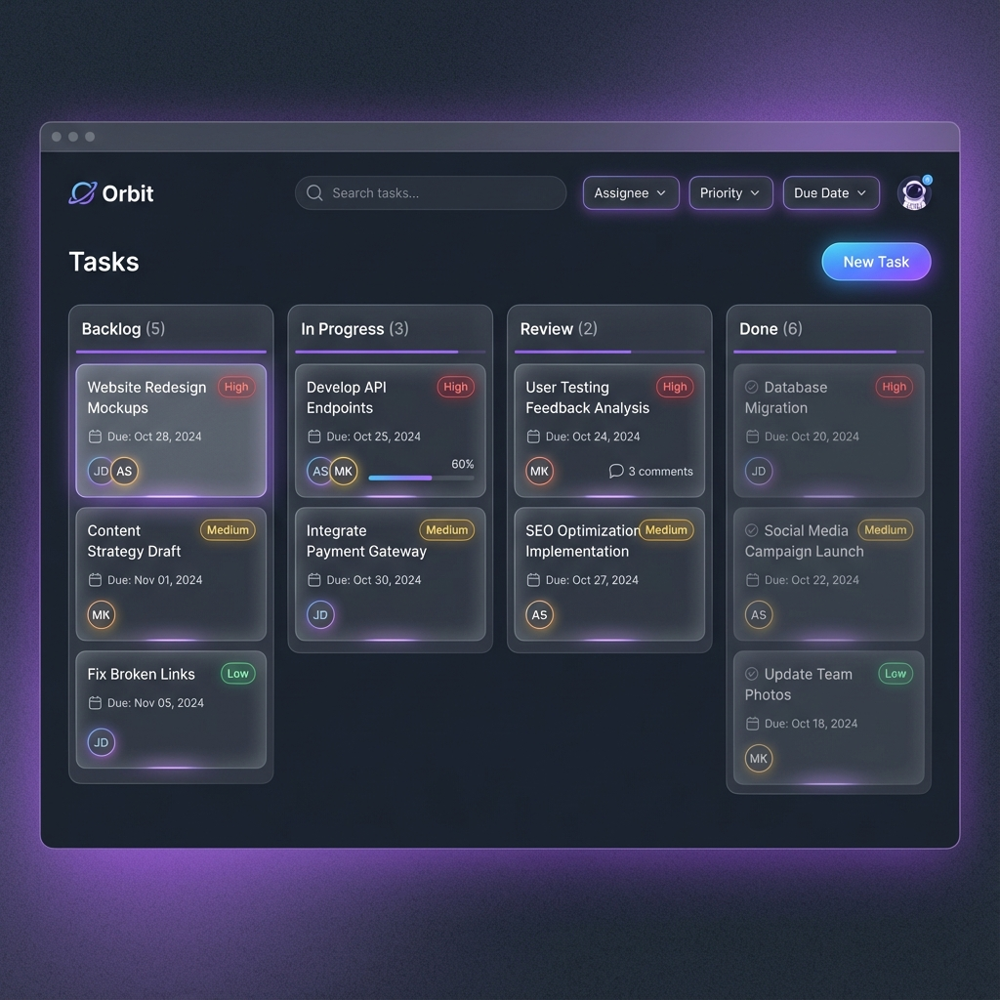

# Tasks Page Design

## Overview
The Tasks page is the core workspace where users manage their work items. It features a full-screen Kanban board with drag-and-drop capabilities.

## Visual Reference

## Key Features

### 1. Kanban Board
- **Columns**:
    - **Backlog**: Unstarted tasks.
    - **In Progress**: Tasks currently being worked on.
    - **Review**: Tasks needing peer review or QA.
    - **Done**: Completed tasks.
- **Drag & Drop**: Smooth transitions when moving cards between columns.

### 2. Task Cards
Glassmorphic cards displaying:
- **Title**: Clear, readable text.
- **Tags**: Colored badges for categories (e.g., "Bug", "Feature").
- **Priority**: Indicator (Red/Yellow/Blue) for urgency.
- **Assignee**: Avatar of the team member responsible.
- **Due Date**: formatted date with color coding for overdue items.

### 3. Filtering & Search
- **Search Bar**: Filter tasks by title or ID.
- **Filters**: Dropdowns for Assignee, Priority, and Tags.
- **View Toggle**: Switch between Board (Kanban) and List view.

## Interactions
- **Click Card**: Opens a modal with full task details (description, comments, subtasks).
- **Add Task**: Floating action button or prominent button in the top bar.
