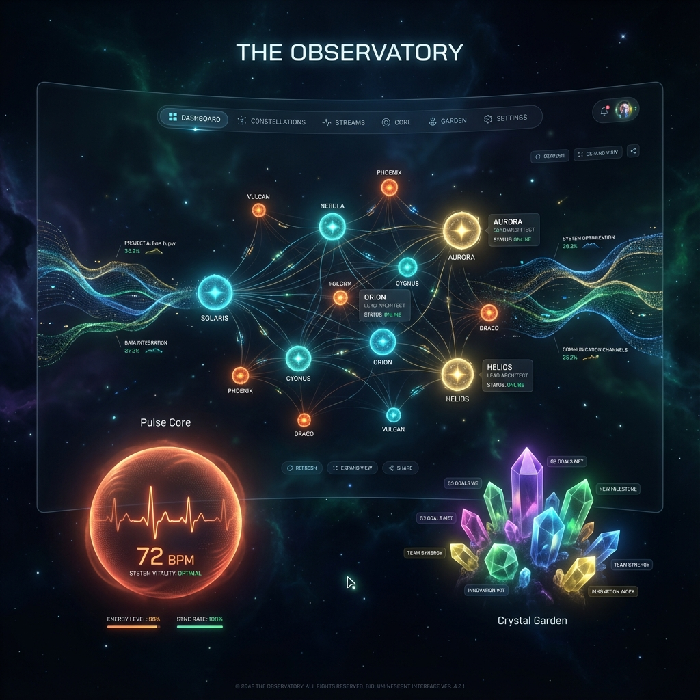
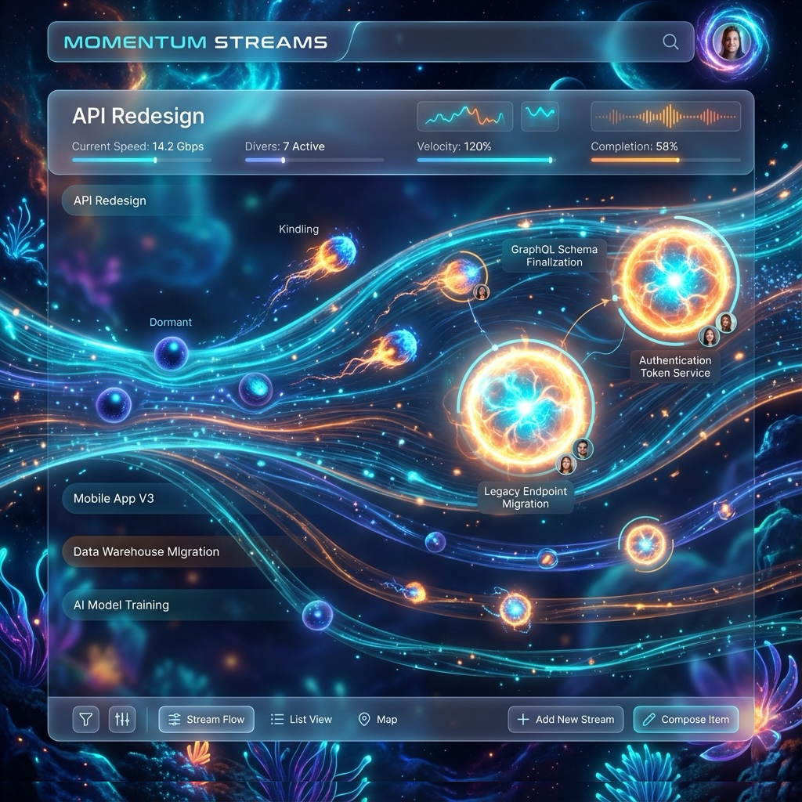
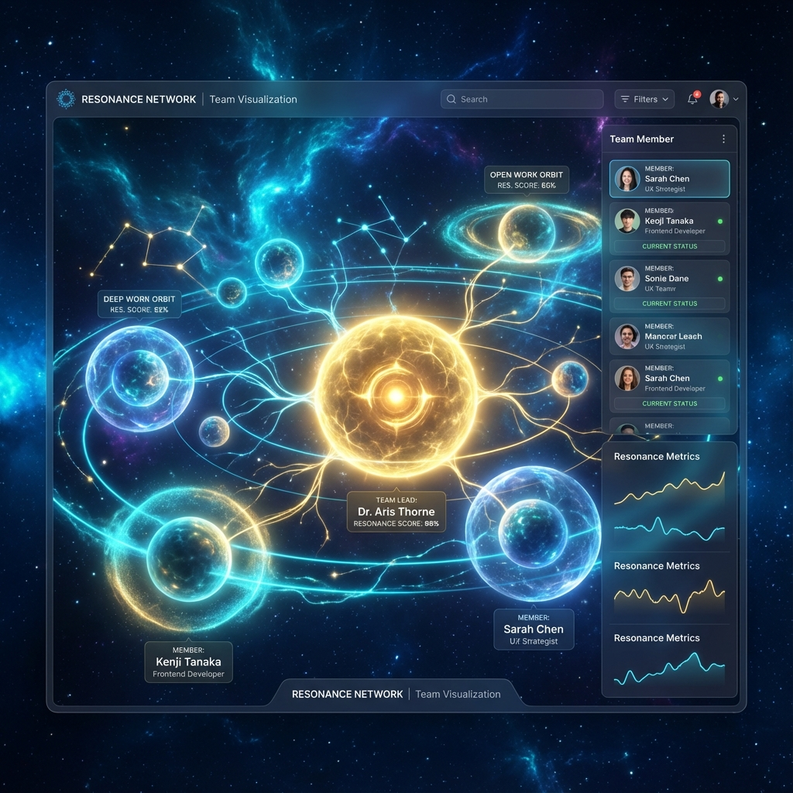
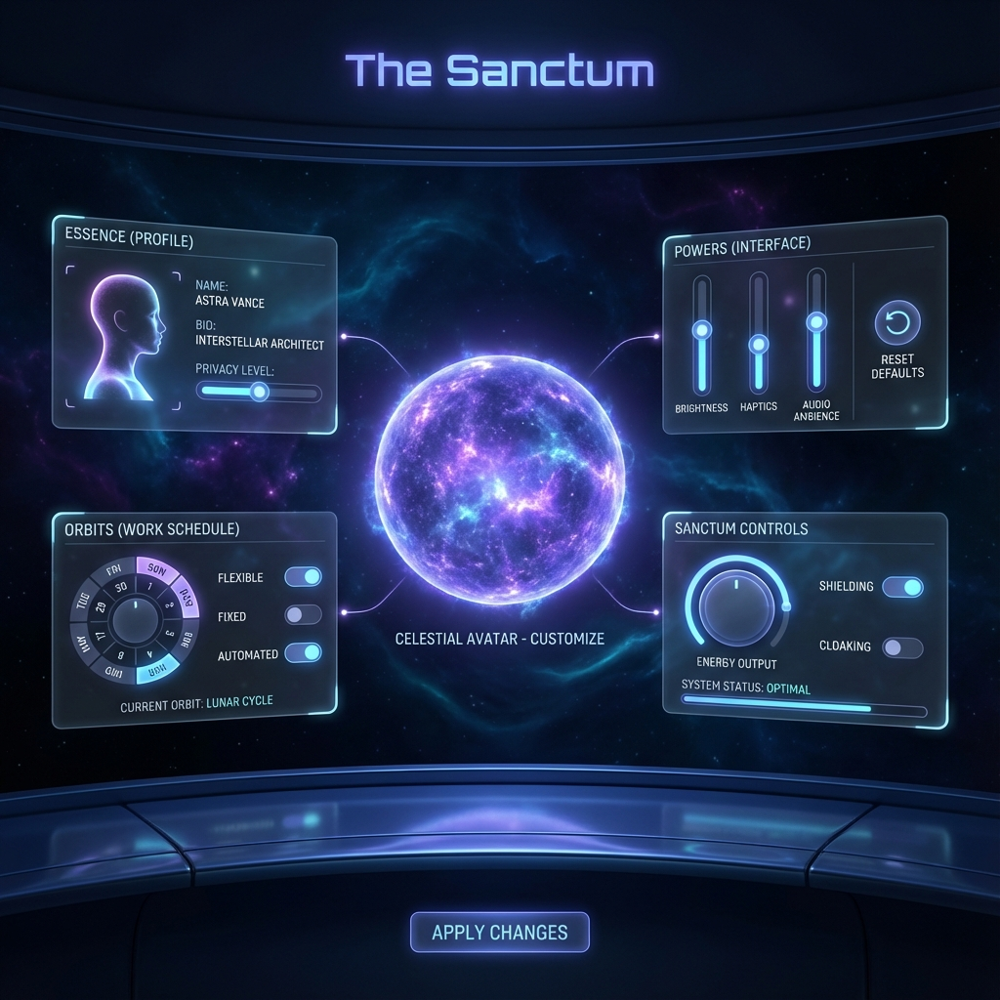
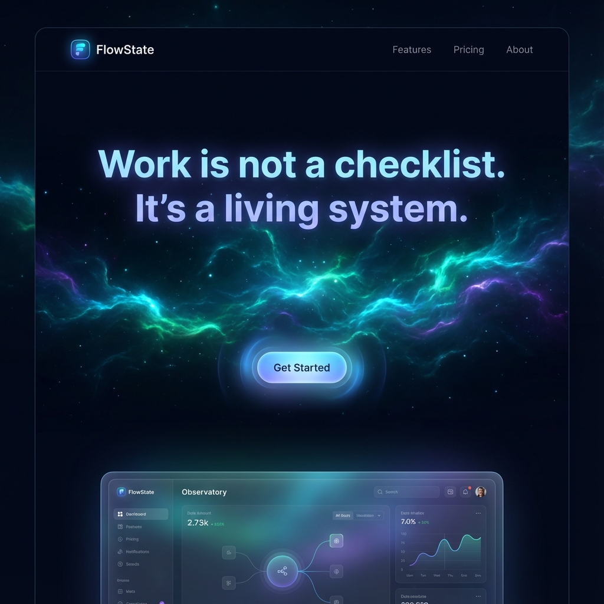
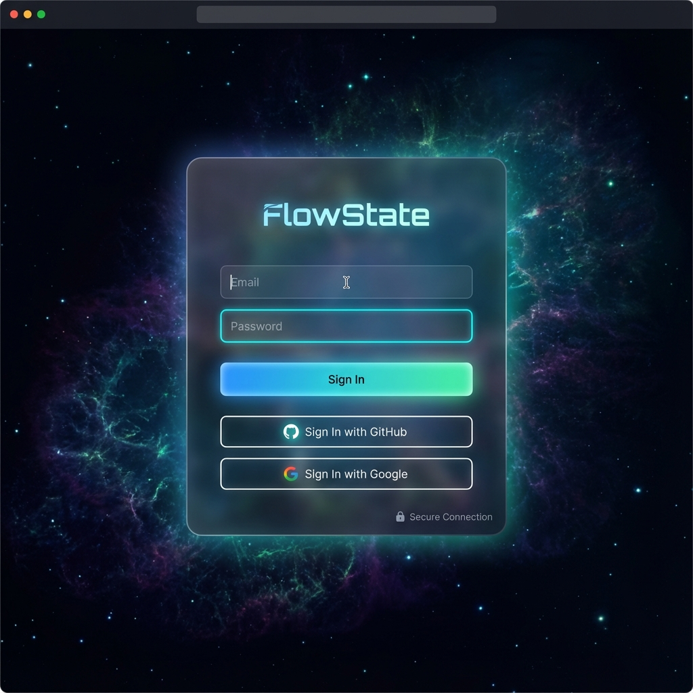

# FlowState UI Mockups

This directory contains high-fidelity UI mockups for the FlowState application, illustrating the "Living Workspace" design concept.

## 1. The Observatory (Dashboard)
The central viewport into the team's activity. A zoomable void showing the team constellation, energy streams, and key health metrics.

## 2. Momentum Streams (Work View)
Work flows as continuous rivers of energy. This view replaces lists and boards with organic, moving streams of particles (tasks) in various energy states.

## 3. Resonance Network (Team View)
The team visualized as a celestial system. Members are stars/bodies with orbits, and their relationships are visualized as "resonance" connections.

## 4. The Sanctum (Settings)
A personal pocket dimension for customizing your presence in the void. Controls for orbital signals, work preferences, and avatar customization.

## 5. Landing Page (New)
The entry point for new users, introducing the cosmic concepts. Features an immersive 3D void hero section.

## 6. Access Portal (Login)
The secure gateway into the FlowState universe. A glass-morphic interface floating in deep space.

